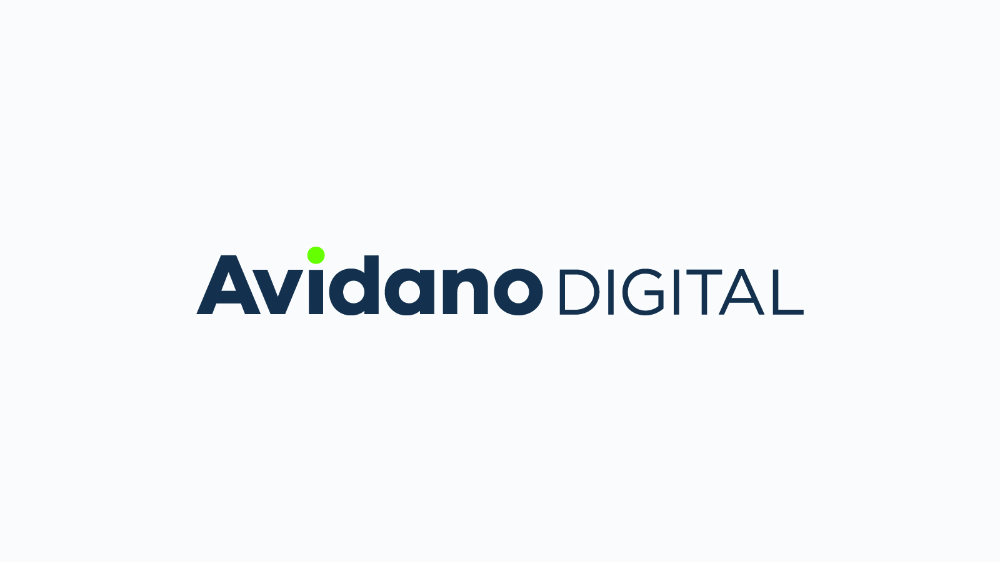
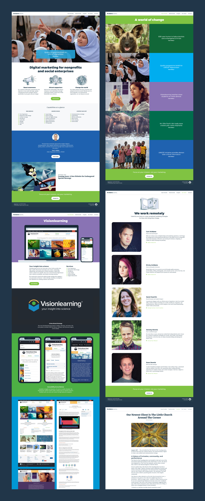
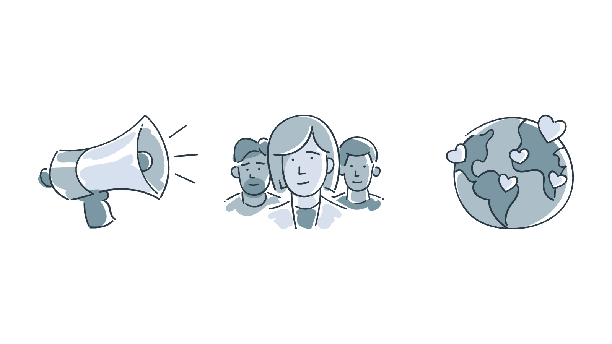
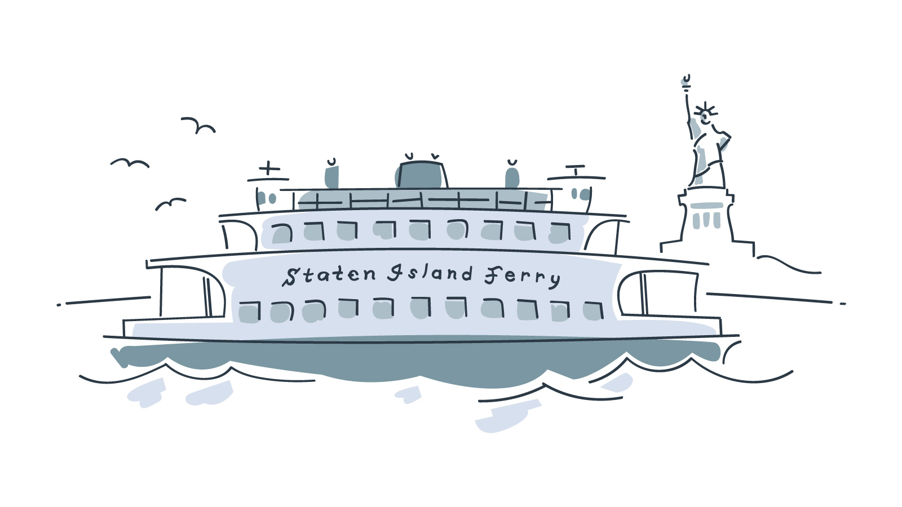

<IntroBlock>

Avidano Digital provided comprehensive digital marketing strategies to social impact organizations. 

</IntroBlock>

<TextBlock>

For several years, I led a small team of graphic designers and front-end developers. Together, we served mission-driven organizations around the world.

</TextBlock>

<FigureSingleBlock caption="Avidano Digital's clean typography-based logo">

    
</FigureSingleBlock>

<TextBlock>

### Crafting the website

I developed Avidano Digital's website using [Craft](https://craftcms.com/), a flexible, user-friendly content management system. The case studies provide details of each project. The *Insights* blog offer a closer look at our process and strategy.

</TextBlock>

<FigureSingleBlock lightbox={true} >

    
</FigureSingleBlock>

<TextBlock>

### Monochrome illustrations

I created a handful of monochromatic, playful illustrations, using a Wacom pen tablet and Adobe Illustrator. A pleasing juxtaposition with the bright, bold colors used throughout the website.

</TextBlock>

<FigureSingleBlock>

    
</FigureSingleBlock>

<FigureSingleBlock>

    
</FigureSingleBlock>

<FigureSingleBlock>

    
</FigureSingleBlock>