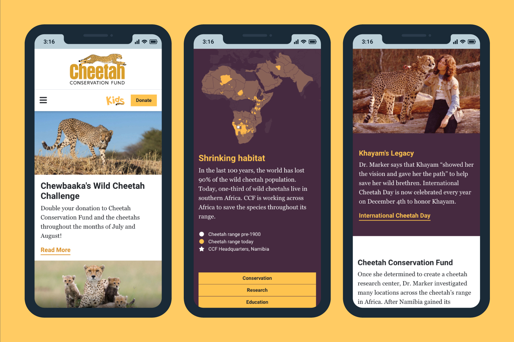

<IntroBlock>

Headquartered in Namibia, Africa, Cheetah Conservation Fund (CCF) is an international conservation organization dedicated to saving the cheetah in the wild.

</IntroBlock>

<TextBlock>

Through Avidano Digital, I led the design and development of a new mobile-friendly website experience for visitors across the world. 

</TextBlock>

<TextBlock>

CCF desired a new logo to replace their outdated, image-based logo, which was not scalable and did not work as a single color. Because their existing logo was so recognizable, a complete redesign was not an option. Instead, I drew a simple, vector version of the cheetah and adjusted the type to make the logo feel contemporary.

</TextBlock>

<FigureSingleBlock>

    
</FigureSingleBlock>

<TextBlock>

Working closely with CCF staff, I restructured the content across cheetah.org to make information easy to find with intuitive navigation in the header and footer. The homepage presents a hierarchy of featured content, up-to-date news, and videos. The information pages are presented in a journalistic, readable style.

</TextBlock>

<FigureSingleBlock>

    
</FigureSingleBlock>

<TextBlock>

Content across cheetah.org is designed for optimal readability on devices and desktops.

</TextBlock>

<FigureSingleBlock>

    
</FigureSingleBlock>

<TextBlock>

The website was built with WordPress and Advanced Custom Fields (ACF). Cheetah.org website managers can update and create content in a consistent way across the site, selecting from a toolkit of modular layout components like full-width banners, galleries, figures, and video.

</TextBlock>

<LiveProjectLink linkURL="https://cheetah.org/" />