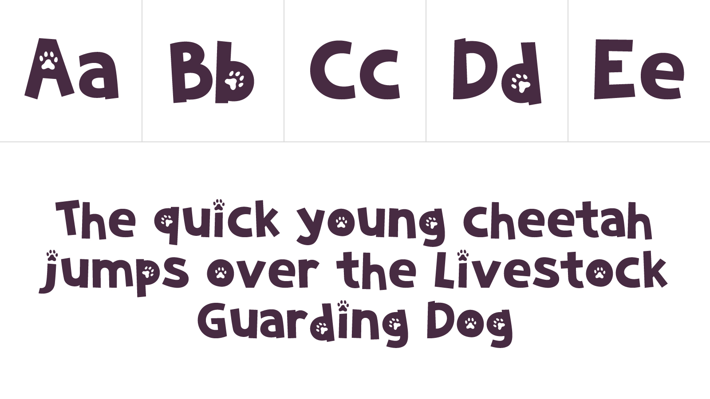

import LogoRedesign from '../../components/portfolio/ccf/LogoRedesign';

<IntroBlock>

Cheetah Conservation Fund is an international organization dedicated to saving cheetahs in the wild.

</IntroBlock>

<TextBlock>

Through [Avidano Digital](/portfolio/avidano-digital), I led the redesign of [cheetah.org](https://cheetah.org).

I built the website with [WordPress](https://wordpress.com/) and Advanced Custom Fields (ACF). Website managers update and create content in a consistent way across the site. They select from a toolkit of layout components like full-width banners, galleries, figures, and video.

</TextBlock>

<TextBlock>

### Logo refresh

CCF wished for a new logo to replace its outdated, photo-based logo. It was not scalable and did not work as a single color. 

Because their logo was so recognizable, **a complete redesign was not an option**. Instead, I drew a simple vector version of the running cheetah. I also adjusted the type to make the logo feel more contemporary.

</TextBlock>

<LogoRedesign />

<TextBlock>

### Website look and feel

Working with CCF staff, we restructured the content across cheetah.org to make information easy to find with intuitive navigation in the header and footer. The homepage offers a hierarchy of featured content, up-to-date news, and videos. The new layouts present information in a journalistic style.

</TextBlock>

<FigureSingleBlock lightbox={true}>

    
</FigureSingleBlock>

<TextBlock>

Large image banners hold the reader's interest within CCF's content-rich *About* pages.

</TextBlock>

<FigureSingleBlock lightbox={true}>

    
</FigureSingleBlock>

<TextBlock>

### Mobile optimized

Across cheetah.org, content is optimized and readable on smaller viewports.

</TextBlock>

<FigureSingleBlock>

    
</FigureSingleBlock>

<TextBlock>

### CCF Kids

The website has an area just for kids! It encourages children and parents to get involved with CCF. To make it stand out on the website, I created a special logo.

</TextBlock>

<FigureSingleBlock caption="The logo for the Kids pages">

    
</FigureSingleBlock>

<TextBlock>

In addition to the CCF *Kids* logo, I created an entire font called **Cheetah Tracks** using [Fontself](https://www.fontself.com/). I used the web font on headers within the *Kids* section. CCF also uses the font for email and print communications. 

</TextBlock>

<FigureSingleBlock caption="Example of Cheetah Tracks">

    
</FigureSingleBlock>

<TextBlock>

Tess Sheehey created the illustrations for the *Kids* page.

</TextBlock>

<FigureSingleBlock>

    
</FigureSingleBlock>

<TextBlock>

The new cheetah.org launched in June of 2019. I am so grateful for the opportunity to work with CCF to raise awareness on their efforts to save the cheetah from extinction.

</TextBlock>

<LiveProjectLink linkURL="https://cheetah.org/" />