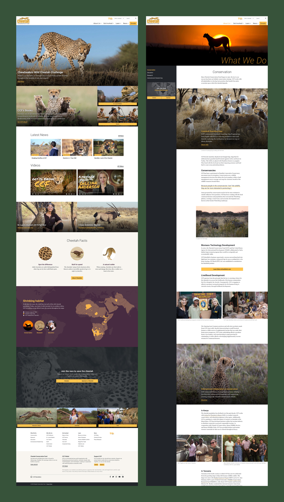
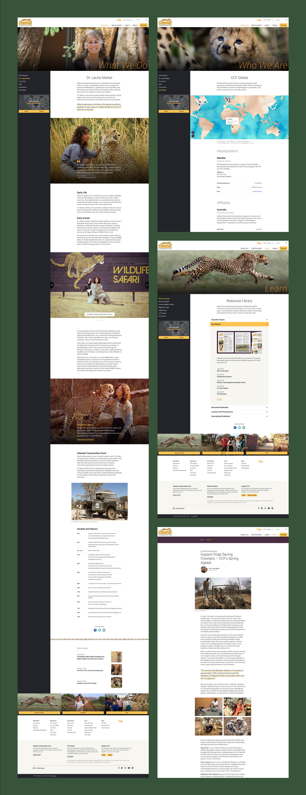

import LogoRedesign from '../../components/portfolio/ccf/LogoRedesign';

<IntroBlock>

The Cheetah Conservation Fund is an international organization dedicated to saving cheetahs in the wild.

</IntroBlock>

<TextBlock>

Through [Avidano Digital](/portfolio/avidano-digital), I led the redesign of [cheetah.org](https://cheetah.org).

</TextBlock>

<LogoRedesign />

<TextBlock>

CCF wished for a new logo to replace its outdated, image-based logo. It was not scalable and did not work as a single color. Because their logo was so recognizable, a complete redesign was not an option. Instead, I drew a simple, vector version of the running cheetah. I also adjusted the type to make the logo feel more contemporary.

</TextBlock>

<FigureSingleBlock>

    
</FigureSingleBlock>

<TextBlock>

Working closely with CCF staff, I restructured the content across cheetah.org to make information easy to find with intuitive navigation in the header and footer. The homepage offers a hierarchy of featured content, up-to-date news, and videos. The new layouts present information in a journalistic, readable style.

</TextBlock>

<FigureSingleBlock>

    
</FigureSingleBlock>

<TextBlock>

Content across cheetah.org is optimized and readable on smaller devices and larger desktops.

</TextBlock>

<FigureSingleBlock>

    
</FigureSingleBlock>

<TextBlock>

The website was built with WordPress and Advanced Custom Fields (ACF). Cheetah.org website managers can update and create content in a consistent way across the site, selecting from a toolkit of modular layout components like full-width banners, galleries, figures, and video.

</TextBlock>

<FigureSingleBlock boxShadow={true}>

    
</FigureSingleBlock>

<LiveProjectLink linkURL="https://cheetah.org/" />