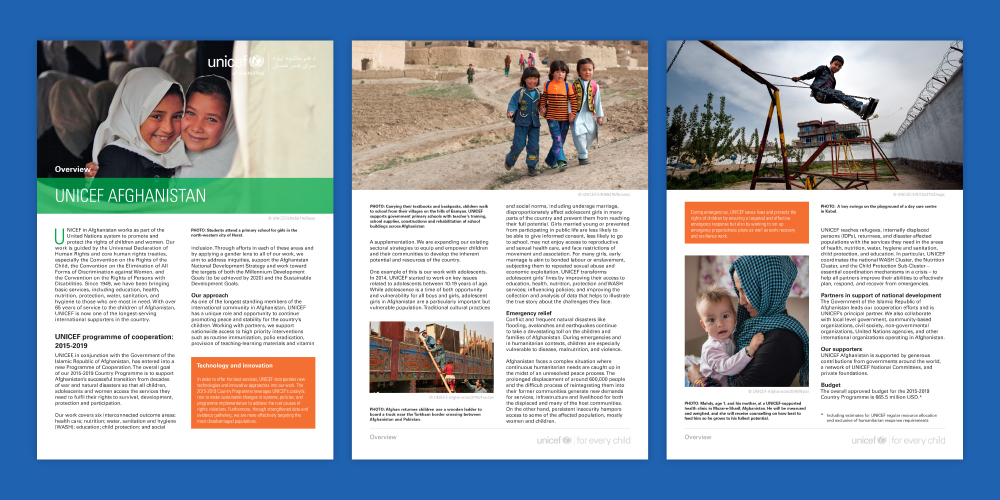
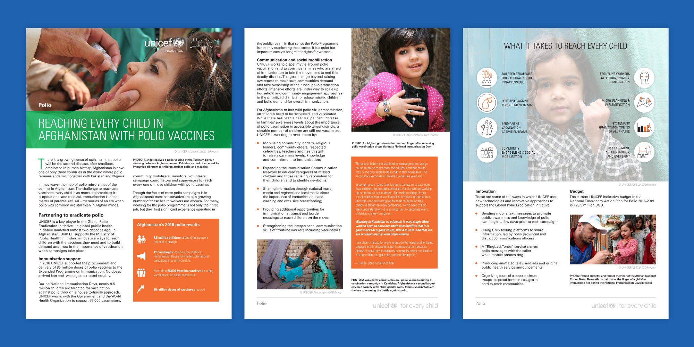
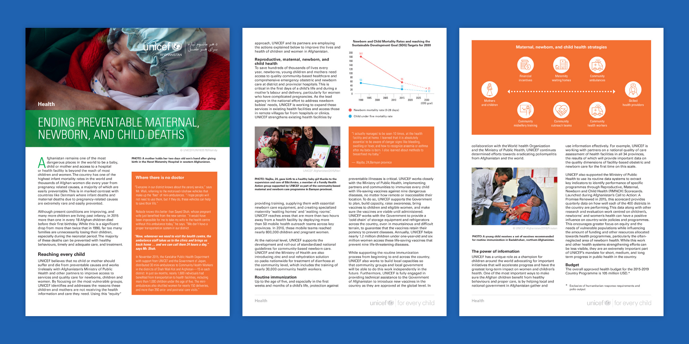
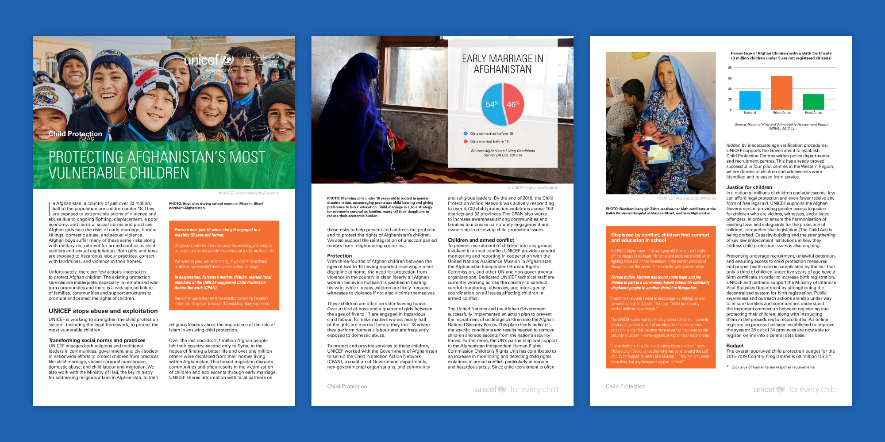
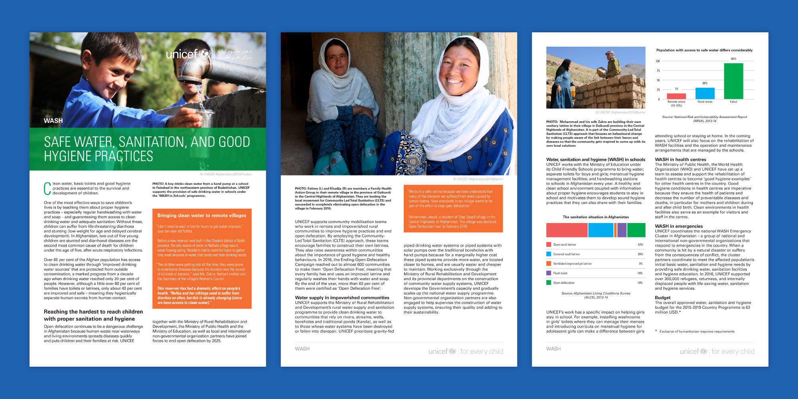
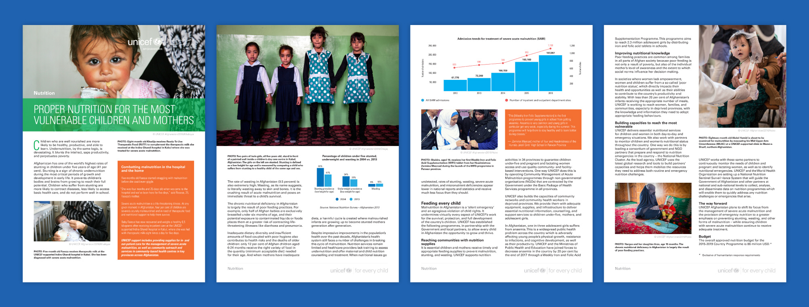
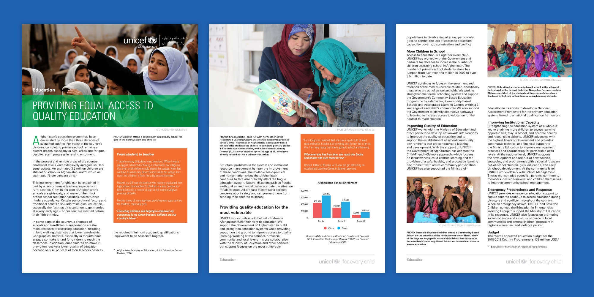

<IntroBlock>

The DevSmart Group provides fundraising and donor relations support to UN agencies and NGOs. 

</IntroBlock>

<TextBlock>

I worked with the DevSmart Group and UNICEF Afghanistan staff to develop programme briefs reporting UNICEF's progress in:

- Polio
- Health
- Child Protection
- WASH
- Nutrition
- Education

</TextBlock>

<FigureSingleBlock
    lightbox={true}
    caption="UNICEF Afghanistan Overview"
>

    
</FigureSingleBlock>

<TextBlock>

### Data visualization

UNICEF Afghanistan and DevSmart Group provided figures, charts, and graphs in Microsoft Word. I redesigned this data in vector format using Adobe Illustrator, then integrated them into the documents in Adobe InDesign. In doing so, we could ensure consistent fonts, colors, and spacing across all figures. Bold colors help the figures stand out, while their size and orientation allow them to fit within the flow of the text.

</TextBlock>

<FigureSingleBlock
    lightbox={true}
    caption="UNICEF Afghanistan Polio"
>

    
</FigureSingleBlock>

<FigureSingleBlock
    lightbox={true}
    caption="UNICEF Afghanistan Health"
>

    
</FigureSingleBlock>

<FigureSingleBlock
    lightbox={true}
    caption="UNICEF Afghanistan Child Protection"
>

    
</FigureSingleBlock>

<FigureSingleBlock
    lightbox={true}
    caption="UNICEF Afghanistan WASH"
>

    
</FigureSingleBlock>

<FigureSingleBlock
    lightbox={true}
    caption="UNICEF Afghanistan Nutrition"
>

    
</FigureSingleBlock>

<FigureSingleBlock
    lightbox={true}
    caption="UNICEF Afghanistan Education"
>

    
</FigureSingleBlock>
