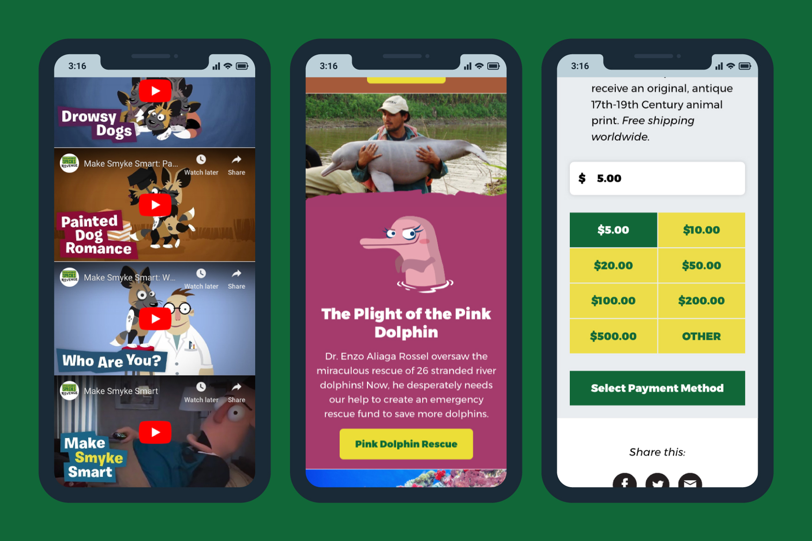
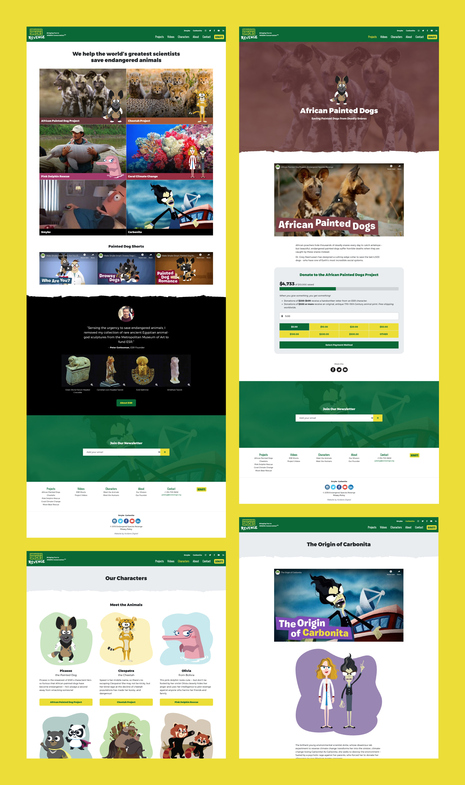

<IntroBlock>

Endangered Species Revenge makes people laugh while raising awareness about endangered animals. 

</IntroBlock>

<TextBlock>

Through [Avidano Digital](/portfolio/avidano-digital), I designed and developed a new website which serves as a foundation for ESR to grow their video content and supporters. With a limited budget and timeline, a custom WordPress theme was made using Bootstrap 4. I continue to work with ESR, planning a blog and additional conservation projects for our next phase.

</TextBlock>

<FigureSingleBlock>

    
</FigureSingleBlock>

<TextBlock>

Donors can give to a specific project, or to the one that is most urgent, quickly and confidently from any device.

</TextBlock>

<FigureSingleBlock lightbox={true}>

    
</FigureSingleBlock>

<TextBlock>

The new ESR website balances humor with a sense of urgency. Visitors can watch funny videos, learn about conservation, and support endangered animals.

</TextBlock>

<LiveProjectLink linkURL="https://esrevenge.org/" />