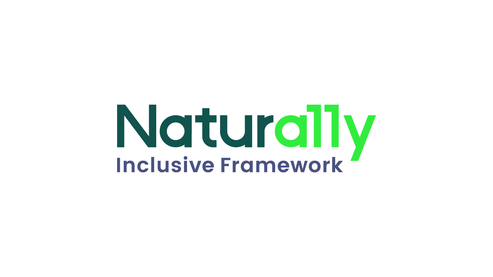
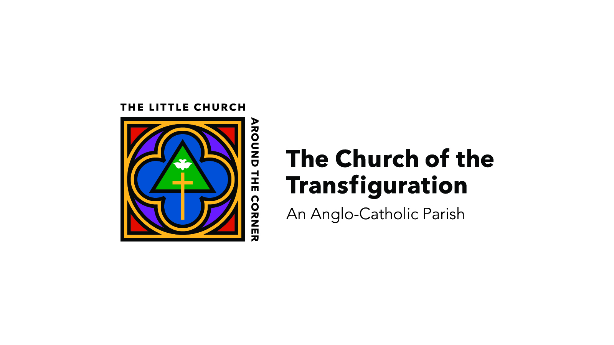
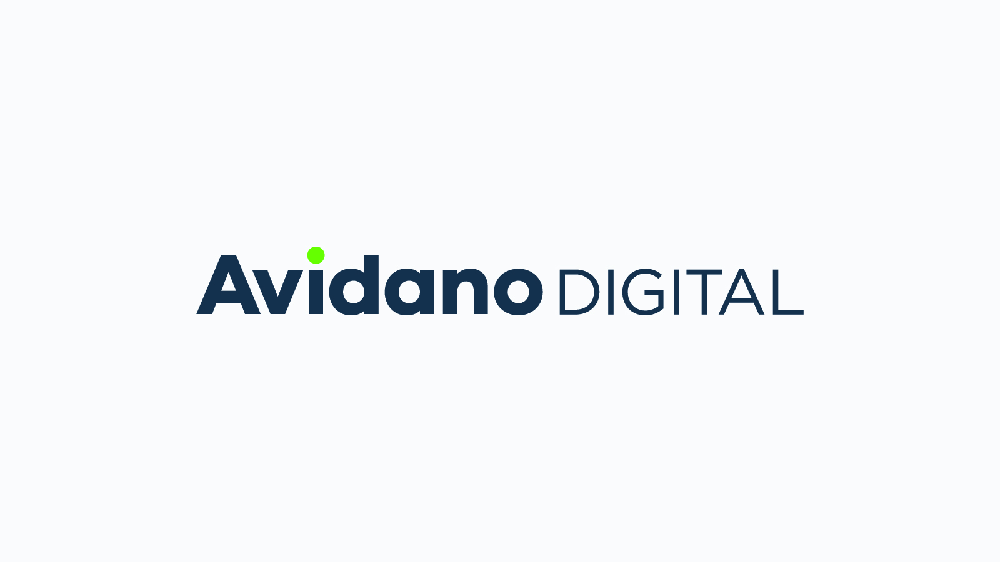
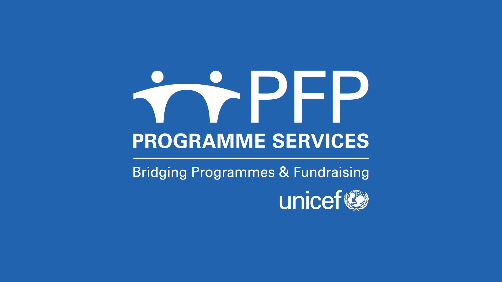

<IntroBlock>

I enjoy the challenge of creating a good logo.

</IntroBlock>

<TextBlock>
    
These are only a handful of the logos I have created over the years. 

</TextBlock>

<FigureSingleBlock>

    
</FigureSingleBlock>

<FigureSingleBlock>

    
</FigureSingleBlock>

<FigureSingleBlock>

    
</FigureSingleBlock>

<FigureSingleBlock>

    
</FigureSingleBlock>

<FigureSingleBlock>

    
</FigureSingleBlock>

<FigureSingleBlock>

    
</FigureSingleBlock>

<FigureSingleBlock>

    
</FigureSingleBlock>

<FigureSingleBlock>

    
</FigureSingleBlock>

<FigureSingleBlock>

    
</FigureSingleBlock>

<FigureSingleBlock>

    
</FigureSingleBlock>

<FigureSingleBlock>

    
</FigureSingleBlock>

<FigureSingleBlock>

    
</FigureSingleBlock>