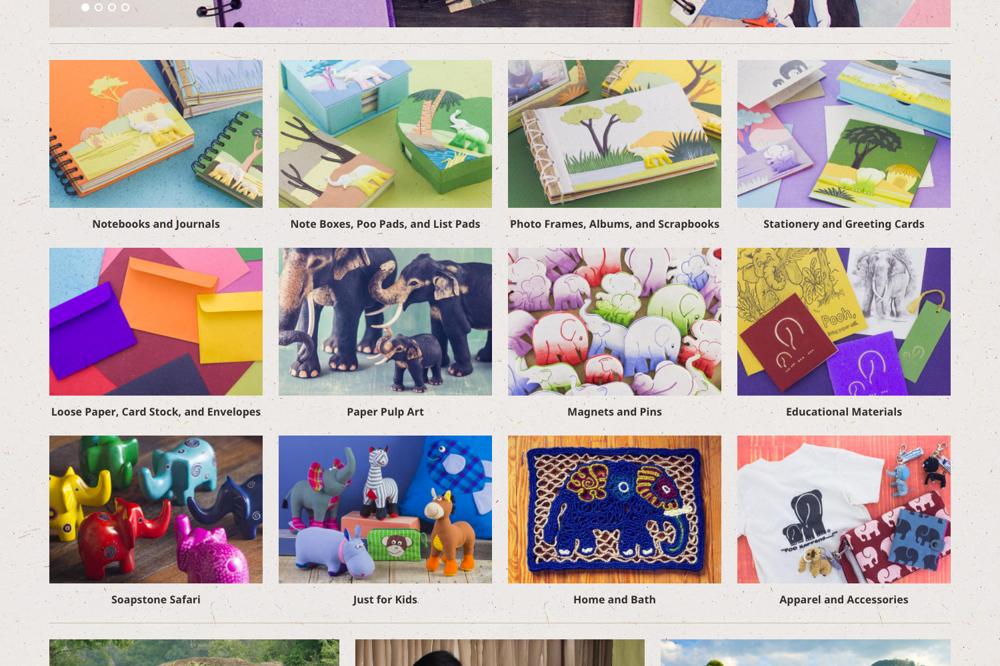
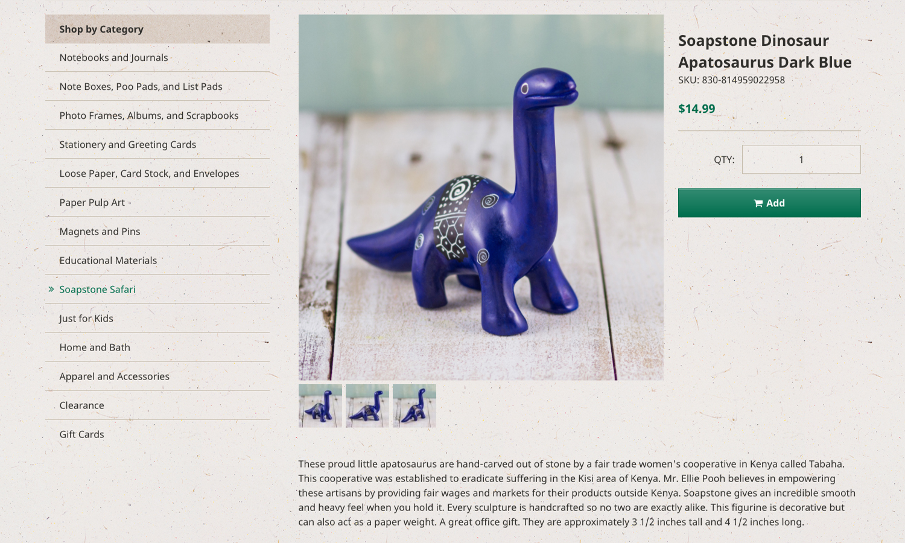

<IntroBlock>

Mr. Ellie Pooh's signature paper products conserves trees and provides jobs to artisans in Sri Lanka.

</IntroBlock>

<TextBlock>

Through [Avidano Digital](/portfolio/avidano-digital), I led the redesign of Brooklyn-based Mr. Ellie Pooh's e-commerce website.

</TextBlock>

<TextBlock>

### Modernizing with Shopify

We decided to use [Shopify](https://www.shopify.com/) for Mr. Ellie Pooh's website redesign. At the time, Shopify itself was new. Its liquid templating language has easy learning curve, which sped up development time. On top of that, Shopify has an efficient and modern inventory management system.

Their new online store balanced a delightful shopping experience with important insight into Mr. Ellie Pooh's mission: fair trade, sustainability, and conservation.

</TextBlock>

<FigureSingleBlock lightbox={true}>

    
</FigureSingleBlock>

<TextBlock>

### Mobile Optimized

Mr. Ellie Pooh experienced a dramitic increase in sales since the launch of their new, mobile-friendly website.

</TextBlock>

<FigureSingleBlock>

    
</FigureSingleBlock>

<TextBlock>

### Product Photography

Mobile customers can shop until they drop—instead of dropping before they shop.

</TextBlock>

<FigureSingleBlock>

    
</FigureSingleBlock>

<TextBlock>

The global footer highlights Mr. Ellie Pooh's three-fold mission. 

</TextBlock>

<FigureSingleBlock>

    
</FigureSingleBlock>

<TextBlock>

For three-dimensional products, we photograph multiple views.

</TextBlock>

<FigureSingleBlock>

    
</FigureSingleBlock>

<TextBlock>

For three-dimensional products, we included multiple views on product detail pages.

</TextBlock>

<FigureSingleBlock>

    
</FigureSingleBlock>

<TextBlock>

In Sri Lanka, we photographed papermakers and artisans. At home, we photograph all products.

</TextBlock>