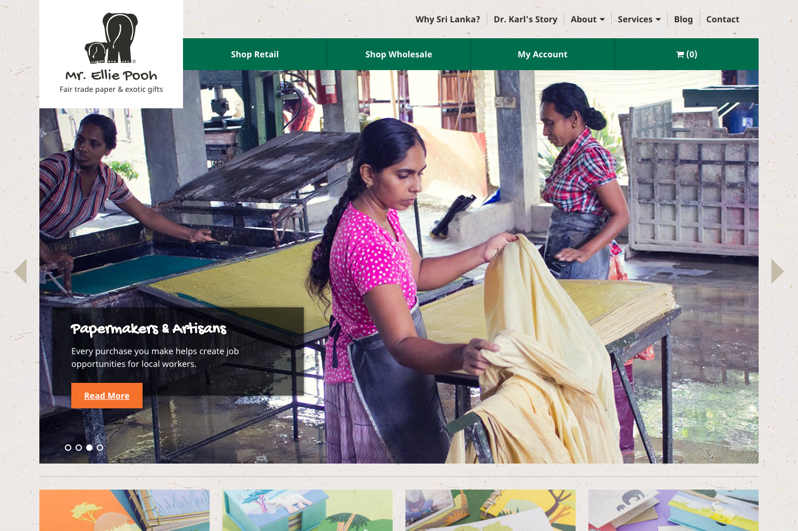

<IntroBlock>

Mr. Ellie Pooh's signature paper products conserve trees and create jobs for artisans in Sri Lanka.

</IntroBlock>

<TextBlock>

Through [Avidano Digital](/portfolio/avidano-digital), I led the redesign of Mr. Ellie Pooh's online storefront.

</TextBlock>

<TextBlock>

### Modernizing with Shopify

We decided to use [Shopify](https://www.shopify.com/) for Mr. Ellie Pooh's website redesign. Its [liquid](https://shopify.github.io/liquid/) templating language has easy learning curve, which sped up development time. On top of that, Shopify provides an easy-to-use inventory management system.

Their new website balanced a delightful shopping experience with important insight into Mr. Ellie Pooh's mission.

</TextBlock>

<FigureSingleBlock lightbox={true}>

    
</FigureSingleBlock>

<TextBlock>

### Mobile Optimized

Mr. Ellie Pooh experienced a dramitic increase in sales after the launch of their new, mobile-friendly website.

</TextBlock>

<FigureSingleBlock>

    
</FigureSingleBlock>

<TextBlock>

### Promoting Fair Trade

Mr. Ellie Pooh is a member of the [Fair Trade Federation](https://www.fairtradefederation.org/). That means a safe and healthy working environment for papermakers and artisans. My sister and I traveled to the paper factory near Kegalle, Sri Lanka. We met the people behind the products. We photographed the workers and the paper-making process. 

The *Papermakers and Artisans* section establishes transparency. It helps inform shoppers about the positive impacts of purchasing fair trade products.

</TextBlock>

<FigureSingleBlock>

    
</FigureSingleBlock>

<TextBlock>

### Product Photography

My wife and I photographed hundreds of products for  Mr. Ellie Pooh's website! The new product photography is consistent in style and accurately shows product colors.

</TextBlock>

<FigureSingleBlock caption="Product category grid on the homepage">

    
</FigureSingleBlock>

<FigureSingleBlock caption="Example of Mr. Ellie Pooh's product photos">

    
</FigureSingleBlock>

<LiveProjectLink linkURL="https://mrelliepooh.com" />