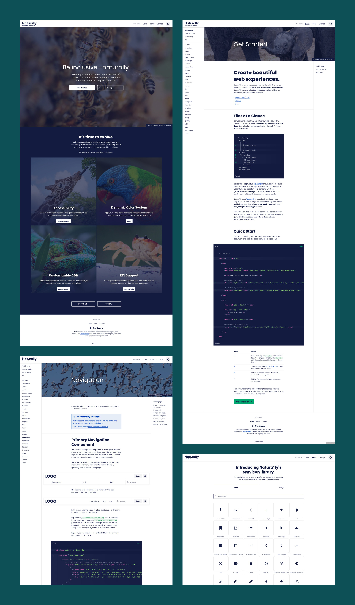
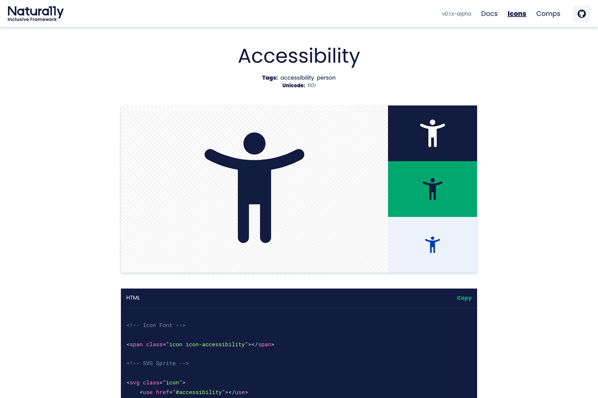

<IntroBlock>

Natura11y is an open source front-end framework. It helps designers and developers create rich, accessible experiences.

</IntroBlock>

<TextBlock>

Natura11y Inclusive Framework aims to remove technical barriers for those with limited time or resources. Natura11y is ideal for real-world, time-sensitive projects.

</TextBlock>

<TextBlock>

### What's with the name?

The name ***Natura11y*** is a combination of two words: *natural* and *a11y*. Among web designers and developers, the word *accessibility* is often abbreviated to *a11y*. This numeronym refers to 'a' then '11' characters between 'y'.

Natura11y is a framework that:

- Feels natural to learn and use 
- Includes accessibility considerations
- Can adapt and evolve for any type of project 

</TextBlock>

<FigureSingleBlock caption="Natura11y's official logo">

    
</FigureSingleBlock>

<TextBlock>

### Creating the documentation

The documentation for Natura11y was a project in and of itself as I don't consider myself a natural writer. It took some time for me to get into the *flow* of writing. It helped me to remember that documentation is never final; it will change and evolve alongside the product it is written for.

All of the nature images on the website were carefully selected from [Unsplash](https://unsplash.com). I made sure to credit each photographer, of course. Browse the [docs](https://gonatura11y.com/docs/get-started), and notice the images used on each page relate to that page's subject matter.

</TextBlock>

<FigureSingleBlock lightbox={true}>

    
</FigureSingleBlock>

<TextBlock>

I built the website for Natura11y using [Gatsby](https://www.gatsbyjs.com/), a React-based open source framework. This approach allowed me to mix React components (for the examples) with [MDX](https://mdxjs.com/) (for the documentation's text).

</TextBlock>

<TextBlock>

### Icon library

I am also developing an icon library to be used with the framework. This will be ongoing, and the library will grow over time.

Developers can choose to use Natura11y's icon font or SVG sprite. If you know how to use NPM, you ca even add your own icons to your project.

</TextBlock>

<FigureSingleBlock>

    
</FigureSingleBlock>

<TextBlock>

Natura11y is my first real contribution to the open source community. It's currently in pre-release. I aim to release version 1.0.0 in the first or second  quarter of 2022.

</TextBlock>

<LiveProjectLink linkURL="https://gonatura11y.com" />