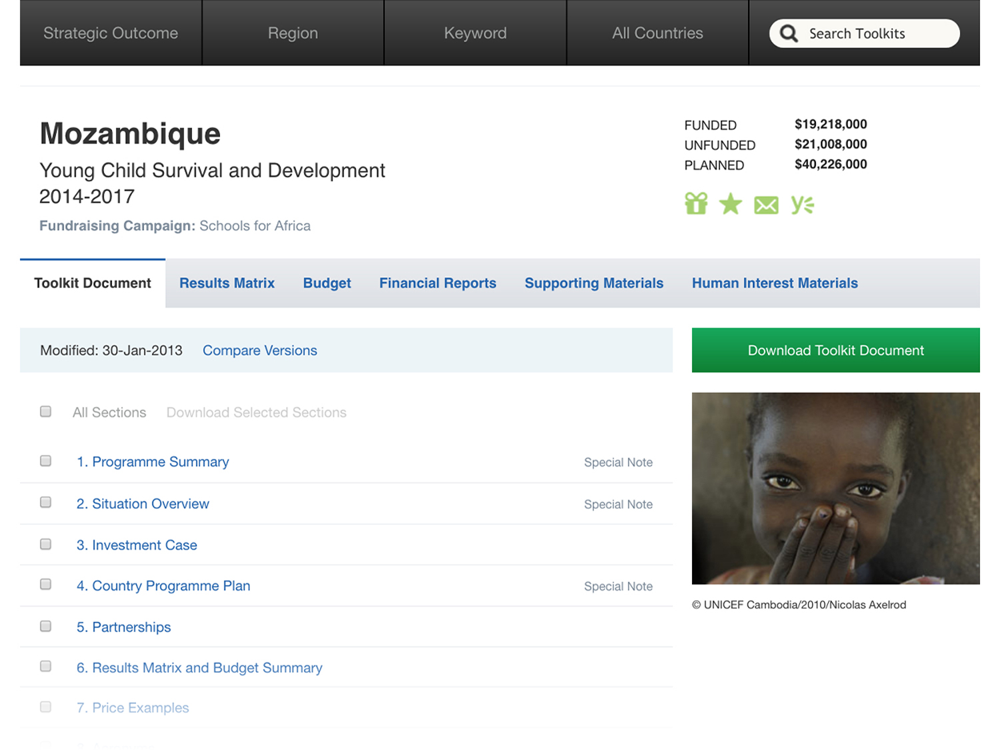
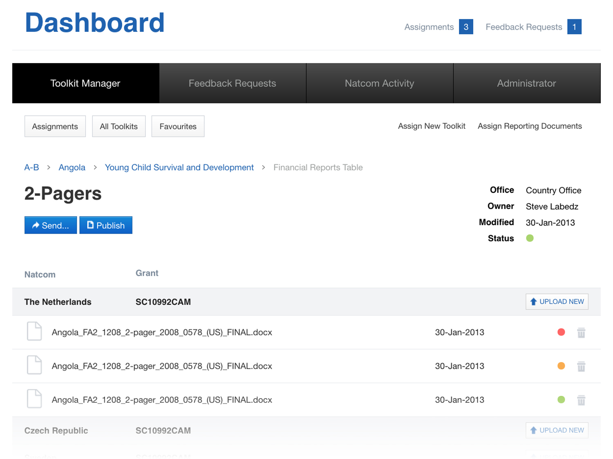
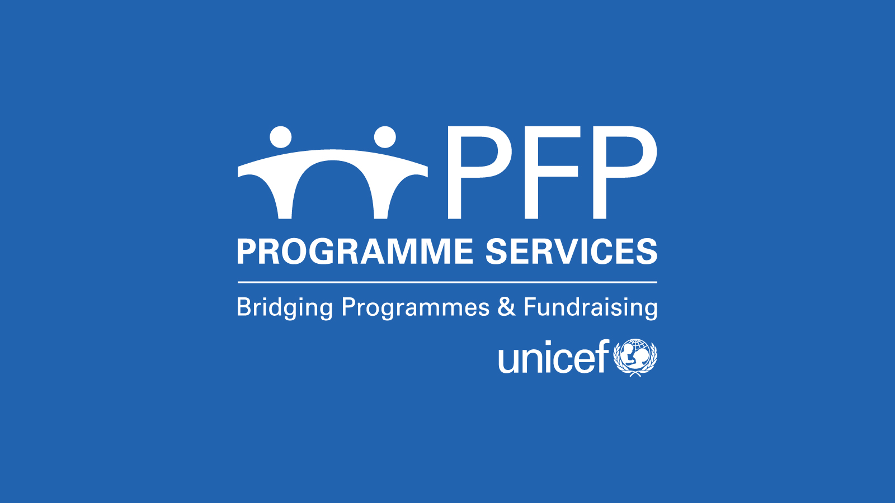

<IntroBlock>

Used in over 80 countries, UNICEF's Funding Marketplace improves the quality of donor income.

</IntroBlock>

<TextBlock>

My work with UNICEF began as an independent contractor. This assignment continued through my company, [Avidano Digital](/portfolio/avidano-digital). 

</TextBlock>

<TextBlock>

### Designing a Prescriptive CMS

With direction from a tech lead and UNICEF staff, I was the sole UX designer of The Funding Marketplace. This custom-designed CMS regulates donor-facing financial data, budget reports, and Human Interest Materials. 

</TextBlock>

<FigureSingleBlock lightbox={true}>

    
</FigureSingleBlock>

<TextBlock>

The Funding Marketplace empowered UNICEF Country Offices to share critical information to donors. The desktop application made this information available via *Donor Toolkits*.

The application interface offered several ways to search and filter available Donor Toolkits.

</TextBlock>

<FigureSingleBlock>

    
</FigureSingleBlock>

<TextBlock>

Toolkits present a wealth of complex funding information without overwhelming the interface.

</TextBlock>

<FigureSingleBlock>

    
</FigureSingleBlock>

<TextBlock>

Country offices collect and share Human Interest Materials including stories, photos, and videos.

</TextBlock>

<FigureSingleBlock>

    
</FigureSingleBlock>

<TextBlock>

UNICEF donors can pledge directly from the Toolkits.

</TextBlock>

<FigureSingleBlock>

    
</FigureSingleBlock>

<TextBlock>

### Toolkit dashboard

The dashboard area allows UNICEF staff to manage Donor Toolkit content. Here, too, Country Offices and donors can communicate with one another.

</TextBlock>

<FigureSingleBlock>

    
</FigureSingleBlock>

<TextBlock>

Toolkit Document are assigned through the dashboard, with each document's owndership and status available at a glance.

</TextBlock>

<FigureSingleBlock>

    
</FigureSingleBlock>

<TextBlock>

I created a logomark for PFP Programme Services. The division responsible for the Donor Toolkit initiative.

</TextBlock>

<FigureSingleBlock>

    
</FigureSingleBlock>
