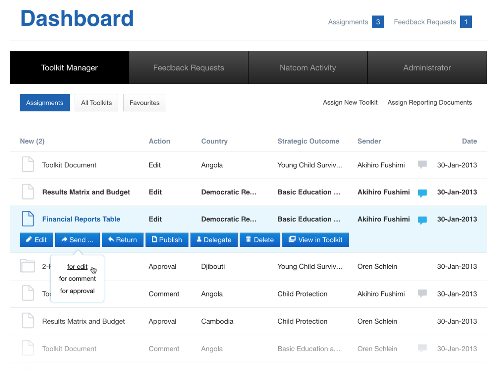

<IntroBlock>

Used in over 80 countries, UNICEF's Funding Marketplace improves the quality of donor income.

</IntroBlock>

<TextBlock>

I began working with UNICEF an independent contractor. This work continued through my company, [Avidano Digital](/portfolio/avidano-digital). 

</TextBlock>

<TextBlock>

### Prescriptive CMS

I was the sole UI designer and front-end developer for The Funding Marketplace. This prescriptive content management system regulates donor-facing financial data, budget reports, and Human Interest Materials.

</TextBlock>

<FigureSingleBlock lightbox={true}>

    
</FigureSingleBlock>

<TextBlock>

I worked closely with UNICEF staff and QuarkXPress in Dublin, Ireland to design and develop the front end of the user interface for the Toolkits.

</TextBlock>

<FigureSingleBlock lightbox={true}>

    
</FigureSingleBlock>

<FigureSingleBlock lightbox={true}>

    
</FigureSingleBlock>

<TextBlock>

There are several ways to browse available Toolkits.

</TextBlock>

<FigureSingleBlock lightbox={true}>

    
</FigureSingleBlock>

<TextBlock>

Country offices can share Human Interest Materials including stories, photos, and videos.

</TextBlock>

<FigureSingleBlock lightbox={true}>

    
</FigureSingleBlock>

<TextBlock>

In a second phase, I designed a Dashboard that allows UNICEF staff to manage the Toolkits and communicate with country offices and donors.

</TextBlock>
