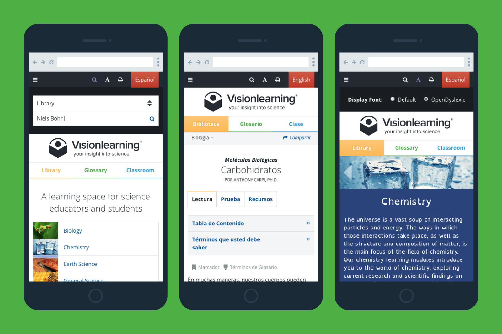
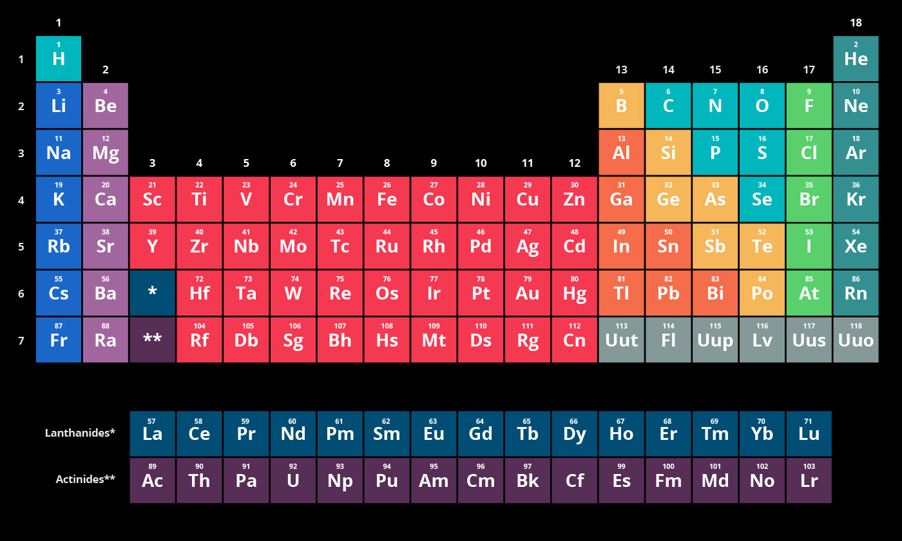

<IntroBlock>

Visionlearning is a free, online learning space for teachers and students of S.T.E.M. disciplines.

</IntroBlock>

<TextBlock>

Through [Avidano Digital](/portfolio/avidano-digital), I worked closely with Visionlearning educators and staff to completely rebrand and redesign their online learning materials.

</TextBlock>

<TextBlock>

### Logo design

It's a student reading. It's an eye. It's the new Visionlearning logo inviting teachers and students to access their high-quality online educational materials.

</TextBlock>

<FigureSingleBlock caption="The new Visionlearning logo">

    
</FigureSingleBlock>

<TextBlock>

### Look and feel

One can easily feel overwhelmed when learning anything new, particularly undergraduate-level science! I intentionally used common design patterns and familiar UX elements like tabs and accordions across the entire website. To make it easier to navigate and discover Visionlearning's numerous learning features, several elements were tailored to their one-of-a-kind modular content.

</TextBlock>

<FigureSingleBlock lightbox={true}>

    
</FigureSingleBlock>

<TextBlock>

### Inclusivilty

Visionlearning's content is available in English and Spanish, while the OpenDyslexic typeface option makes reading easier for dyslexic learners. Disabled users can access all content through keyboard navigation.

</TextBlock>

<FigureSingleBlock>

    
</FigureSingleBlock>

<TextBlock>

### Feature highlights

The multi-tier breadcrumb makes it easy to navigate disciplines and topics from the module.

</TextBlock>

<FigureSingleBlock>

    
</FigureSingleBlock>

<TextBlock>

In the reading, glossary terms are highlightable. They link through to the *Glossary* section.

</TextBlock>

<FigureSingleBlock>

    
</FigureSingleBlock>

<TextBlock>

The Glossary uses accordion-style definitions, audio pronunciation, and links to relevant content in the Library.

</TextBlock>

<FigureSingleBlock>

    
</FigureSingleBlock>

<TextBlock>

### Digital Illustration

Using Adobe Illustrator and Photoshop, I created custom scientific illustrations to add clarity to a variety of complex scientific topics. Style for these figures depended on their placement and meaning within the content.

The complexity of these illustrations ranged from simple chemical formulas to visualizing the anatomy of plant and animal cells. Below are just a few of these illustrations.

</TextBlock>

<FigureSingleBlock caption="Illustrations created for 'Discovery and Structure of Cells'">

    
</FigureSingleBlock>

<FigureSingleBlock caption="Illustrations of scientific experiments were created using a cohesive style">

    
</FigureSingleBlock>

<FigureSingleBlock caption="RNA and DNA structural composition">

    
</FigureSingleBlock>

<FigureSingleBlock caption="Four levels of protein structure">

    
</FigureSingleBlock>

<FigureSingleBlock caption="The periodic table of elements">

    
</FigureSingleBlock>